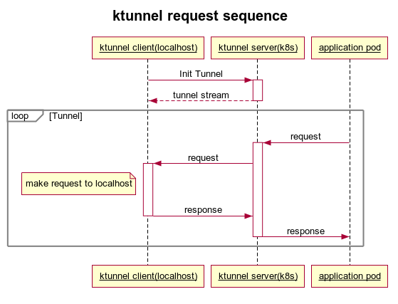

<p align="center">
  <a href="" rel="noopener">
 </a>
</p>

<h3 align="center">ktunnel</h3>
<h4 align="center">A CLI tool that establishes a reverse tunnel between a kubernetes cluster and your local machine</h3>

<div align="center">

  []() 
  [](https://github.com/omrikiei/ktunnel/issues)
  [](https://github.com/omrikiei/ktunnel/pulls)
  [](https://www.gnu.org/licenses/gpl-3.0)

</div>

---

<p align="center">Expose your local resources to kubernetes
    <br> 
</p>

## 📝 Table of Contents
- [Installation](#installation)
- [About](#about)
- [Usage](#usage)
- [Documentation](./docs/index.md)
- [Authors](https://github.com/omrikiei/ktunnel/contributors)

## 🏁 Installation <a name = "installation"></a>
| Distribution                                        | Command / Link                                                                          |
|-----------------------------------------------------|-----------------------------------------------------------------------------------------|
| Pre-built binaries for macOS, Linux, and Windows    | [GitHub releases](https://github.com/omrikiei/ktunnel/releases)                         |
| Homebrew  (macOS and Linux)                         | `brew tap omrikiei/ktunnel && brew install omrikiei/ktunnel/ktunnel`                                     |
| [Krew](https://krew.sigs.k8s.io/)                   | `kubectl krew install tunnel`                                                           |

### Building from source

Clone the project
```
git clone https://github.com/omrikiei/ktunnel; cd ktunnel
```
Build the binary
```
CGO_ENABLED=0 go build -ldflags="-s -w"
```
You can them move it to your bin path
```
sudo mv ./ktunnel /usr/local/bin/ktunnel
```
Test the command
```
ktunnel -h
```

## 🧐 About <a name = "about"></a>
Ktunnel is a CLI tool that establishes a reverse tunnel between a kubernetes cluster and your local machine.
It lets you expose your machine as a service in the cluster or expose it to a specific deployment. 
You can also use the client and server without the orchestration part.
*Although ktunnel is identified with kubernetes, it can also be used as a reverse tunnel on any other remote system*

Ktunnel was born out of the need to access my development host when running applications on kubernetes. 
The aim of this project is to be a holistic solution to this specific problem (accessing the local machine from a kubernetes pod).
If you found this tool to be helpful on other scenarios, or have any suggesstions for new features - I would love to get in touch.

<p align="center">

</p>

<p align="center">

</p>

## 🎈 Usage <a name="usage"></a>
### Expose your local machine as a service in the cluster
This will allow pods in the cluster to access your local web app (listening on port 8000) via 
http (i.e kubernetes applications can send requests to myapp:8000)
```bash
ktunnel expose myapp 80:8000
ktunnel expose myapp 80:8000 -r #deployment & service will be reused if exists or they will be created
```

### Inject to an existing deployment
This will currently only work for deployments with 1 replica - it will expose a listening port on the pod through a tunnel to your local machine
```bash
ktunnel inject deployment mydeployment 3306
``` 

### Star History

[](https://star-history.com/#omrikiei/ktunnel&Timeline)

Made with ❤️ in [Gedera](https://en.wikipedia.org/wiki/Gedera)!
