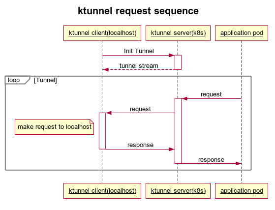

<p align="center">
  <a href="" rel="noopener">
 </a>
</p>

<h3 align="center">ktunnel</h3>
<h4 align="center">A CLI tool that establishes a reverse tunnel between a kubernetes cluster and your local machine</h3>

<div align="center">

  []() 
  [](https://github.com/omrikiei/ktunnel/issues)
  [](https://github.com/omrikiei/ktunnel/pulls)
  [](https://www.gnu.org/licenses/gpl-3.0)

</div>

---

<p align="center">Expose your local resources to kubernetes
    <br> 
</p>

## 📝 Table of Contents
- [Installation](#installation)
- [About](#about)
- [Usage](#usage)
- [Security model](./docs/security.md)
- [Documentation](./docs/index.md)
- [Roadmap](./ROADMAP.md)
- [Authors](https://github.com/omrikiei/ktunnel/contributors)

## 🏁 Installation <a name = "installation"></a>
| Distribution                                        | Command / Link                                                                          |
|-----------------------------------------------------|-----------------------------------------------------------------------------------------|
| Pre-built binaries for macOS, Linux, and Windows    | [GitHub releases](https://github.com/omrikiei/ktunnel/releases)                         |
| Homebrew  (macOS and Linux)                         | `brew tap omrikiei/ktunnel && brew install omrikiei/ktunnel/ktunnel`                                     |
| [Krew](https://krew.sigs.k8s.io/)                   | `kubectl krew install tunnel`                                                           |

### Building from source

Clone the project
```
git clone https://github.com/omrikiei/ktunnel; cd ktunnel
```
Build the binary
```
CGO_ENABLED=0 go build -ldflags="-s -w"
```
You can them move it to your bin path
```
sudo mv ./ktunnel /usr/local/bin/ktunnel
```
Test the command
```
ktunnel -h
```

## 🧐 About <a name = "about"></a>
Ktunnel is a CLI tool that establishes a reverse tunnel between a kubernetes cluster and your local machine.
It lets you expose your machine as a service in the cluster or expose it to a specific deployment. 
You can also use the client and server without the orchestration part.
*Although ktunnel is identified with kubernetes, it can also be used as a reverse tunnel on any other remote system*

Ktunnel was born out of the need to access my development host when running applications on kubernetes. 
The aim of this project is to be a holistic solution to this specific problem (accessing the local machine from a kubernetes pod).
If you found this tool to be helpful on other scenarios, or have any suggesstions for new features - I would love to get in touch.

<p align="center">

</p>

<p align="center">

</p>

## 🎈 Usage <a name="usage"></a>
### Expose your local machine as a service in the cluster
This will allow pods in the cluster to access your local web app (listening on port 8000) via 
http (i.e kubernetes applications can send requests to myapp:80)
```bash
ktunnel expose myapp 80:8000
ktunnel expose myapp 80:8000 -r # use an existing deployment & service as they are, or create them
```

`--reuse` adopts. If the Deployment and Service are already there — because you
wrote them yourself for a private registry or a security context your cluster
admits — ktunnel uses them exactly as they stand and does not modify them, and
does not delete them on exit either. If they are not there, it creates them, and
removes what it created when you stop it. `--force` deletes and recreates
instead.

### Inject to an existing deployment
This opens a listening port inside the deployment's own pods, tunnelled to your
local machine, so the application reaches your laptop at `localhost:3306`.
```bash
ktunnel inject deployment mydeployment 3306
```

The sidecar's listeners are pod-local: only containers in an injected pod reach
your machine through them. So every replica is injected and every replica is
tunnelled — forwarding to one arbitrary pod of several would leave the rest with
the port closed, and nothing to say which pod was the working one. A deployment
with three replicas takes three local ports, counting up from `--port`, and
opens three streams to your machine.

Replicas added while the tunnel is up are picked up the next time it is rebuilt,
since the set of pods is resolved once per connection attempt.


### Which namespace
`--namespace` if you pass it; otherwise the namespace of your kubeconfig
context (`--context` selects which context); otherwise `default`. It is
resolved once, at startup, and printed with its source, so there is no guessing
which namespace the objects went to:

```
Using namespace team-a (kubeconfig context "dev")
```

### What it will do, before it does it
Both commands print their plan before the first write, and say what happens
when you stop them:

```
In namespace team-a, ktunnel will:
  use the existing deployment team-a/myapp as it is (2 replica(s), image nexus.corp.example/ktunnel:v2.1.0); it will be neither modified nor deleted
  create service team-a/myapp (ClusterIP, port(s) 80->8080)
On exit it will remove service myapp, and leave deployment myapp as it was.
```

`inject` says the same about the container it adds, how many pods that
restarts, and which local ports the replicas take.

### Reconnecting
`expose`, `inject` and `client` reconnect on their own when a tunnel drops -- a
dropped VPN, a suspended laptop, a rescheduled pod. Each attempt rebuilds the
whole local side: it re-resolves the tunnel server's pod, rebuilds the
port-forward and reopens the stream, with an exponential backoff from 1s up to
30s that resets once a tunnel has stayed up for a minute.

**Open connections do not survive a reconnect.** The cluster-side listener is
closed and every connection through it is dropped, exactly as any TCP proxy
restart does; a fresh listener binds the same port when the tunnel comes back.

Cluster resources are never recreated by a reconnect. If the deployment is
deleted mid-session, ktunnel keeps retrying and says why, rather than quietly
recreating what you removed.

The default is to retry forever, which is what an interactive session wants.
Under a process supervisor, ask for an exit code instead:

```bash
# exit non-zero the moment the tunnel drops, and let systemd restart it
ktunnel expose myapp 80:8000 --exit-on-disconnect

# or give up after 10 consecutive failed attempts
ktunnel expose myapp 80:8000 --max-reconnect-attempts 10
```

ktunnel exits 0 on Ctrl+C and 1 when it gives up.

### Resource Cleanup
ktunnel now automatically tracks and cleans up resources (deployments and services) when the process exits. This ensures no orphaned resources are left in your cluster, even after unexpected shutdowns.

- Resources are automatically cleaned up when you press Ctrl+C
- A 30-second timeout ensures cleanup doesn't hang indefinitely
- Use the `-v` flag for verbose logging to see cleanup operations
```bash
ktunnel expose myapp 80:8000 -v
```

### Security
The tunnel is **not authenticated**. Anything in the cluster that can reach a
tunnelled port reaches whatever is listening behind it on your machine, and
`--tls` is not available for `expose` or `inject` yet. That is the trade for a
tool that installs no operator and needs no cluster-wide permissions, and it
makes ktunnel a development-cluster tool.

[docs/security.md](./docs/security.md) has the whole picture: what is reachable
from where, what is encrypted, what authenticates what, the Kubernetes
permissions ktunnel uses, and how to narrow the exposure in the meantime.

### Star History

[](https://star-history.com/#omrikiei/ktunnel&Timeline)

Made with ❤️ in [Gedera](https://en.wikipedia.org/wiki/Gedera)!
