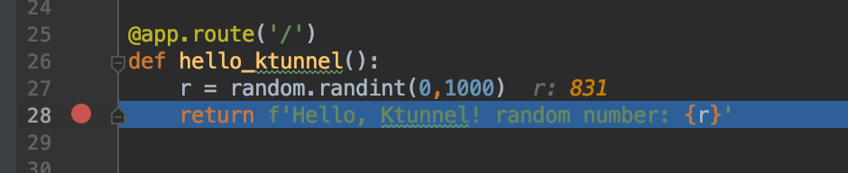
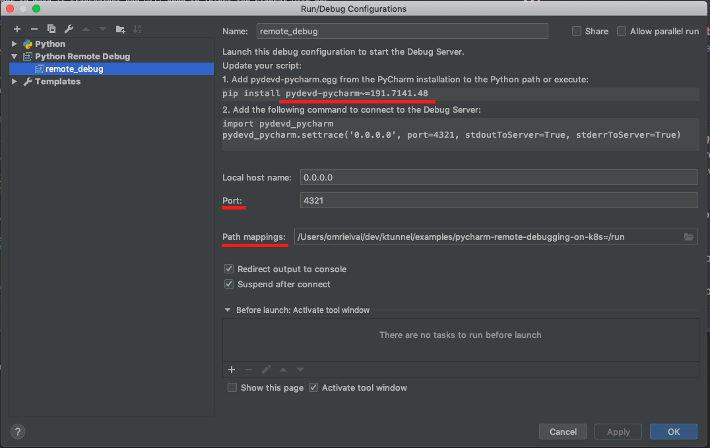

# Debugging a python application running on  kubernetes with Pycharm (with breakpoints and the whole shebang)
One of the pains of running a containerized application on kubernetes is the inability to debug it with a normal IDE. 
With Python, there are nice solutions for remote debugging such as [remote-pdb](https://pypi.org/project/remote-pdb/) but it would never be as convenient as debugging your application with a real IDE.

## The problem
Although Intellij did an amazing job with [guidance and support](https://www.jetbrains.com/help/pycharm/remote-debugging-with-product.html) for remote debugging, their solutions are incompatible with a remote runtime that is unfamiliar with the development environment, 
or in simpler terms - in order for remote debugging to work, the runtime (python process) needs to have network access to the IDE(your workstation).

Under the hood Pycharm uses a debugger based on [pydevd](https://www.pydev.org/manual_adv_remote_debugger.html) - which only supports connecting from the runtime as a client and not listening to incoming connections inside the runtime as a server.

A naive solution to this problem can be coupling a sidecar running sshd with your deployment, and running a reverse SSH client tunnel . 
It would probably work - but in order to make it transparent one will need to inject the sidecar with one's public key, then run the SSH client and keep the tunnel open... seems like a lot of work.

Another alternative is using [telepresence](telepresence.io) to actually run the service locally, but that would mean one would need to build/install dependencies locally - which sometimes mean a lot of time and work and without even mentioning the CPU and memory that our app will consume.  

## Ktunnel to the rescue
[Ktunnel](github.com/omrikiei/ktunnel) is a CLI that establishes a reverse tunnel from kubernetes and exposes your workstation to traffic from kubernetes, this means one can expose one's workstation to a kubernetes pod, 
or even as a service. for our use case - it means one can tell a pod running our python app to connect to localhost on the debug port, 
when actually behind the scenes a tunnel will be established to the IDE which is listening on that port on my workstation. pretty neat!

### Getting started
As an example I created a simple flask web server with two endpoints:
  - `/` - will return a random number
  - `/debug` - will run 

When the `/debug` endpoint is called, the runtime should attempt to connect to the debugger and block until it succeeds.

The code along with the kubernetes manifests can be found [here](https://github.com/omrikiei/ktunnel/tree/master/examples/pycharm-remote-debugging-on-k8s)

#### Step 1 - Deploy the app to kubernetes
```bash
> kubectl apply -f deployment.yaml
deployment.extensions/pyremotedebug created
```

let's also port-forward to the web server and send a request:
 ```bash
 > kubectl port-forward pyremotedebug-5dcf9cf4c6-q9tr9 8000
 Forwarding from [::1]:8000 -> 8000
 
 > curl localhost:8000
Handling connection for 8000
Hello, Ktunnel! random number: 409
 ```

#### Step 2 - Open the project on Pycharm and configure a remote debugger
- Open pycharm, open the project (`File->open->"project directory"`).
- Put some breakpoints in the `main.py` file

- Configure a remote debugger according to [these](https://www.jetbrains.com/help/pycharm/remote-debugging-with-product.html#remote-debug-config) instructions. use local host name 'localhost' and port 4321. __Important note! use 'Path Mapping' to map your local project directory to the source Workdir in the container image__ 

- Start the debugger (`Run->debug remote_server`) 

#### Step 3 - Establish the tunnel
```bash
> ./ktunnel inject deployment pyremotedebug 4321
INFO[0000] Debug level is set to info
INFO[0000] Injecting tunnel sidecar to default/pyremotedebug
INFO[0000] Waiting for deployment to be ready
INFO[0011] All pods located for port-forwarding
INFO[0011] Waiting for port forward to finish
INFO[0011] Forwarding from 127.0.0.1:28688 -> 28688
Forwarding from [::1]:28688 -> 28688
INFO[0011] starting tcp tunnel from source 4321 to target 4321
```

#### Step 4 - Call the debug endpoint
```bash
> curl localhost:8000/debug
```
Looking at the container log you will see the following line:
`INFO:root:Connecting to remote debugger on 127.0.0.1:4321`
This means that the debugger is now connected to the runtime

#### Step 5 - Mind Blown
Now, sending a request to the root endpoint will trigger the breakpoint in the IDE:
```bash
> curl -v localhost:8000/
```
We can change the value of `r` in the `Evaluate Expression` window to -1, and the result in our terminal:

```bash
> curl -v localhost:8000/
*   Trying 127.0.0.1...
* TCP_NODELAY set
* Connected to localhost (127.0.0.1) port 8000 (#0)
> GET / HTTP/1.1
> Host: localhost:8000
> User-Agent: curl/7.54.0
> Accept: */*
>
* HTTP 1.0, assume close after body
< HTTP/1.0 200 OK
< Content-Type: text/html; charset=utf-8
< Content-Length: 33
< Server: Werkzeug/0.16.0 Python/3.7.6
< Date: Wed, 25 Dec 2019 06:15:53 GMT
<
* Closing connection 0
Hello, Ktunnel! random number: -1
```

## Important Caveats
- For this to work with your Pycharm installation, the container needs to have a compatible 'pydevd-pycharm' version, in my case it's `pydevd-pycharm~=191.7141.48`
- If you plan on doing this on production services, know that setting breakpoints on production services is not recommended, do at your own risk!
